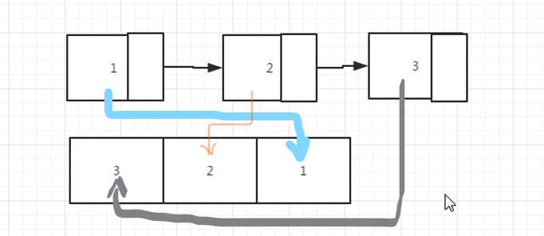

# 题目描述
输入一个链表，按链表从尾到头的顺序返回一个ArrayList。

# 解题思路

1. listNode 是链表，只能从头遍历到尾，但是输出却要求从尾到头，这是典型的"先进后出"，我们可以想到栈！
2. Python中有个方法是 insert(index,value)，可以指定 index 位置插入 value 值。
3. 在遍历 ListNode 的同时将每个遇到的值插入到新list中的 0 位置（头位置），最后输出 新的list 即可得到逆序链表

# 总结
时间复杂度 O(N)，空间复杂度 O(N)。