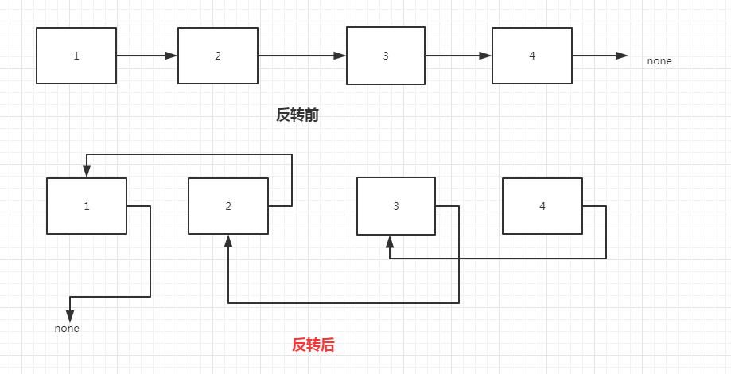

# 题目描述
输入一个链表，反转链表后，输出新链表的表头。

# 解题思路
声明三个指针结点， 用left_node记录前一个结点，mid_node 记录中间结点，right_node记录后一个结点
1. 如果头结点为空，直接返回None；如果头结点的next结点为空，直接返回pHead
2. 将现有的头结点换成尾结点，left_node.next = None
3. 当right_node不为空时， 进入循环
    1. 将从mid_node指向指向前一个
    2. 指向前一个之后，所有的结点都往后移动一个位置，继续执行循环操作
3. 当right_node 为空，停止循环，此时mid_node指向最后一个结点，将其指向left_node
4. 然后返回mid_node所在的结点

# 总结
